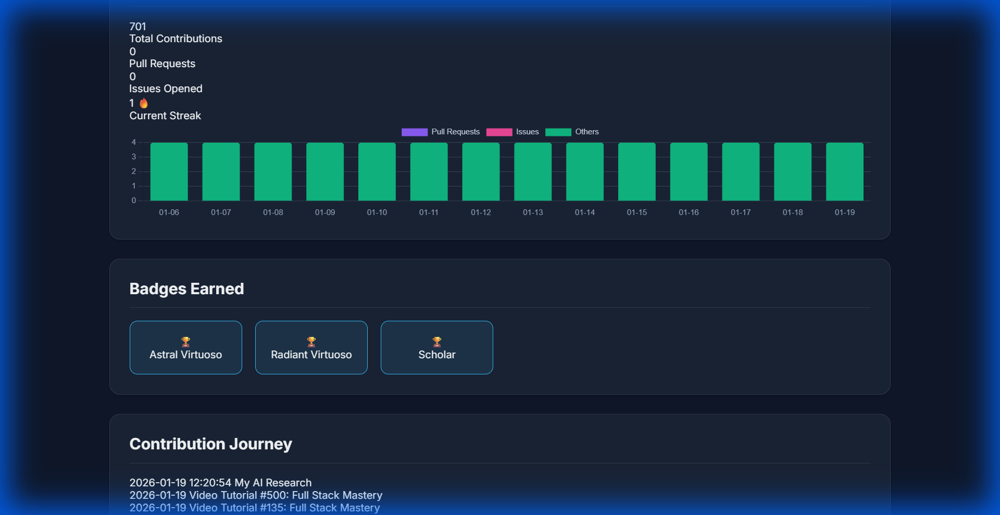

# Virtuoso 🎻
> **The Universal Contribution Aggregator for Developer Communities.**

**Virtuoso** is a powerful, modular engine that tracks, visualizes, and gamifies your community's contributions across the web. Whether it's code on GitHub, support on Discord, tutorials on YouTube, or discussions on Reddit—Virtuoso unifies it all into a single, beautiful "Contribution Story".



## ✨ Key Features

### 1. Unified Identity 🆔
Stop scattering your impact. Virtuoso links user identities across platforms to build a single, comprehensive profile.
- **Supported Platforms**: GitHub, Discord, Discourse, YouTube, Reddit.
- **Modular Architecture**: Add support for *any* new platform (e.g., Crowdin, Dev.to) by adding a single plugin file.

### 2. Gamification & Engagement 🏆
Turn contributions into a journey.
- **Virtuoso Badges**: Automatically award tiers (Bronze, Silver, Gold, Platinum, Diamond, Rhodium) based on total impact.
- **Daily Streaks**: Track consecutive days of activity with the 🔥 Streak Counter.
- **XP Progress**: Visual progress bars show users exactly how close they are to the next tier.

### 3. Advanced Analytics 📊
- **Activity Dashboard**: Interactive charts visualizing contributions over time.
- **Smart Categorization**: Distinguish between Merged PRs, Issues, Videos, and Posts.

### 4. Robust & Resilient 🛡️
- **Crash-Proof Aggregation**: Built with strict timeouts and schema validation. If one API fails, the rest of the system stays live.
- **Persistent Storage**: All links and data are securely stored in SQLite.

### 5. Admin & Management Tools 🛠️
- **Admin Dashboard**: A secure panel (`/admin.html`) to view all users and their linked accounts.
- **Sync Engine**: A background worker that automatically caches contributions every hour, ensuring "Inactive" users stop draining API limits.
- **Security**: Token-based authentication protects administrative actions.

## 🚀 Getting Started

### Prerequisites
- Node.js v16+
- GitHub Token (optional, for higher rate limits)

### Installation
1.  **Clone the repository**
    ```bash
    git clone https://github.com/SankarGaneshb/Virtuoso.git
    cd Virtuoso
    ```

2.  **Install Dependencies**
    ```bash
    npm install
    ```

3.  **Configure Environment**
    Create a `.env` file:
    ```env
    GITHUB_TOKEN=your_token_here
    DISCORD_BOT_TOKEN=your_bot_token (optional)
    ```

4.  **Run the Server**
    ```bash
    node server.js
    ```

5.  **View the Dashboard**
    Open [http://localhost:3000](http://localhost:3000) in your browser.

## 🧩 Extending Virtuoso (Plugins)

Adding a new platform is easy!
1.  Create a file in `src/aggregators/` (e.g., `twitter.js`).
2.  Export the standard interface:
    ```javascript
    module.exports = {
        name: 'Twitter',
        platform: 'Twitter',
        fetch: async (username) => { /* return items */ }
    };
    ```
3.  Add it to `src/aggregators/index.js`.
4.  That's it! It automatically appears in the system.

## 🤝 Contributing

Virtuoso is open source. We love Pull Requests!

---
*Built with ❤️ for the freeCodeCamp community.*
